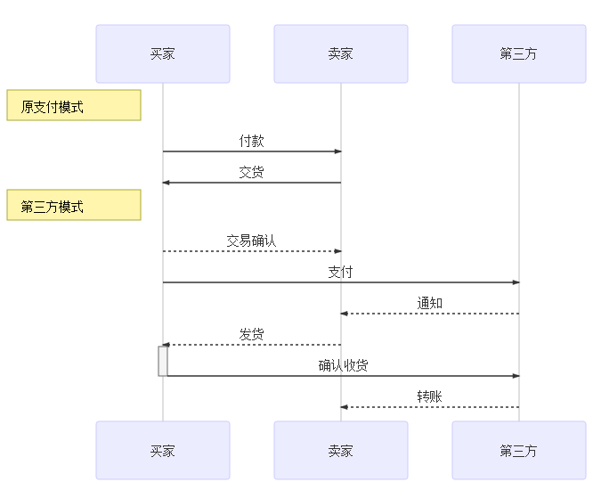

# 第三方支付简介

### 简介

第三方支付是指具备一定实力和信誉保障的独立机构，通过与网联对接而促成交易双方进行交易的网络支付模式。

在第三方支付模式，买方选购商品后，使用第三方平台提供的账户进行货款支付（支付给第三方），并由第三方通知卖家货款到账、要求发货；买方收到货物，检验货物，并且进行确认后，再通知第三方付款；第三方再将款项转至卖家账户。

---

#### 结算方式

1. 一步支付方式

   1. 现金结算
   2. 票据结算
   3. 汇转结算

2. 分布支付方式

   1. 信用证计算
   2. 保函结算
   3. 第三方支付结算

---

### 优缺点

#### 优点

1. 成本优势
2. 竞争优势
3. 创新优势

#### 缺点

1. 风险问题
2. 电子支付经营资格的认知、保护和发展问题
3. 业务革新问题
4. 恶性竞争问题
5. 法律、法规支持问题

